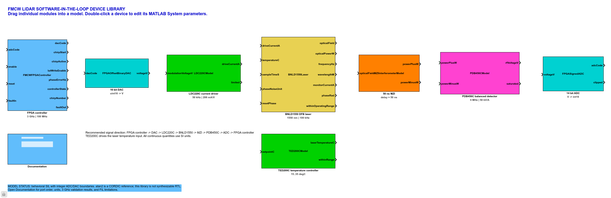

# FMCWLidar-SIL

FMCW LiDAR 发射端的 MATLAB/Simulink software-in-the-loop 仓库。器件模型以独立 MATLAB System 模块提供，并注册为可拖放的 Simulink 库。

## 当前范围

- 16 bit offset-binary DAC
- Thorlabs LDC220C 激光电流驱动器
- Thorlabs TED200C 温度控制器
- BNLD-1550 窄线宽 DFB 激光器
- 50 ns 延迟 MZI
- Thorlabs PDB450C 平衡探测器
- 14 bit signed ADC
- 3 GHz FMCW FPGA 行为参考控制器
- FPGA、DAC、光电器件和 ADC 的六 chirp 联合 SIL 示例

当前模型是算法行为级和整数接口联合仿真，不是可综合 RTL，也不是 FPGA-in-the-loop。

## 快速开始

在 MATLAB 中执行：

```matlab
cd('path/to/FMCWLidar-SIL');
startup_fmcwlidar_sil;
build_fmcwlidar_sil;
open_system('FMCWLidar_SIL_Library');
```

运行 3 GHz、六 chirp SIL 闭环：

```matlab
result = run_fmcw_fpga_algorithm_simulink(true, 6);
```

主要结果字段：

```matlab
result.chirpRmsErrorHz
result.chirpPeakErrorHz
result.chirpSweepBandwidthHz
result.theoreticalRangeResolutionM
result.mziBeatFrequencyHz
result.allWithinLimits
result.anyFault
```

## Simulink Library Browser

运行 `startup_fmcwlidar_sil` 后，在 Library Browser 中刷新库列表，可看到：

```text
FMCW LiDAR SIL
```

也可以直接打开：

```matlab
open_system('FMCWLidar_SIL_Library');
```

库内每个器件都是独立模块。双击 MATLAB System 模块可以查看和修改器件参数；打开 `Documentation` 子系统可以在 Simulink 界面内阅读接口和单位说明。



## 目录

```text
src/devices/    独立器件 MATLAB System 模型
src/control/    FPGA 行为参考控制器
scripts/        参数、建模和运行入口
models/         自动生成并提交的 Simulink 库与 SIL 模型
docs/           器件接口、模型边界和架构说明
```

## 3 GHz 已验证基线

| 项目 | 结果 |
|---|---:|
| 扫频带宽 | 3 GHz |
| chirp 时间 | 50 us |
| MZI 延迟 | 50 ns |
| MZI 拍频 | 3 MHz |
| 理论距离分辨率 | 4.997 cm |
| 第六 chirp RMS 非线性 | 160.97 kHz |
| 第六 chirp峰值误差 | 746.56 kHz |
| 第六 chirp 实际带宽 | 3.002217 GHz |
| 带宽相对误差 | 0.0739% |
| 器件限幅或 FPGA fault | 无 |

这些数值来自关闭随机噪声的确定性软件模型，不能替代真实激光器、探测器和 FPGA 硬件测量。

## 文档

- [`docs/DEVICE_INTERFACES.md`](docs/DEVICE_INTERFACES.md)：所有模块的端口、单位和默认参数
- [`docs/SIL_STATUS.md`](docs/SIL_STATUS.md)：已完成范围、验证结果和进入 FIL 前的缺口
- [`docs/FMCW发射端架构与风险分析.md`](docs/FMCW发射端架构与风险分析.md)：完整器件选型、架构和风险分析
